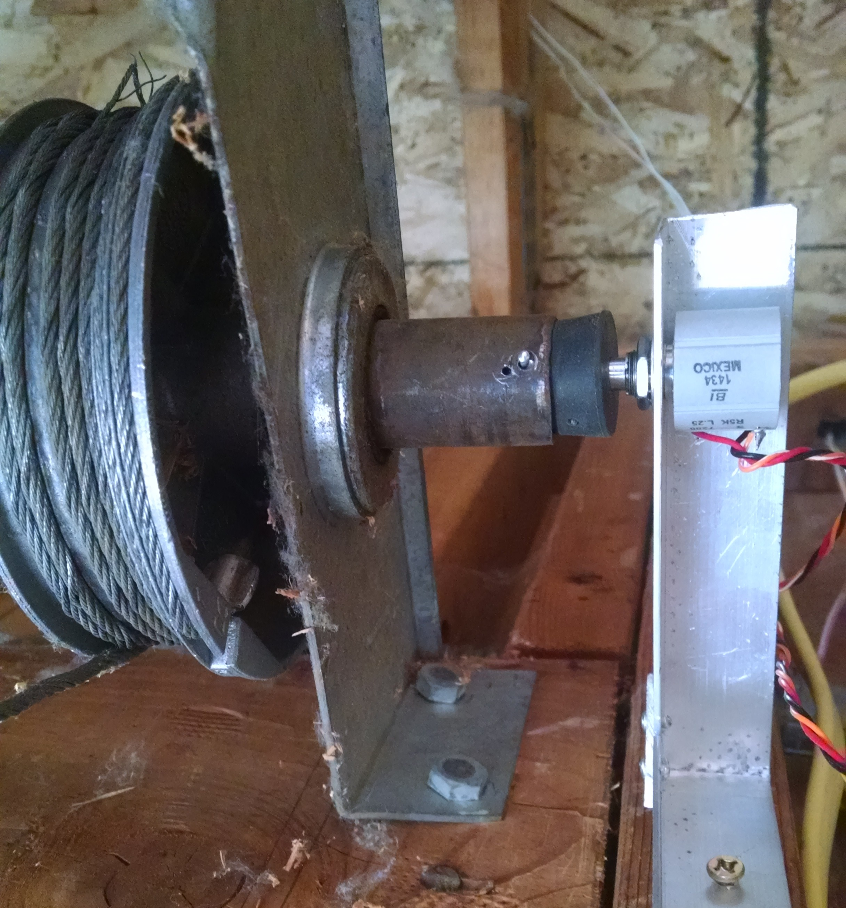
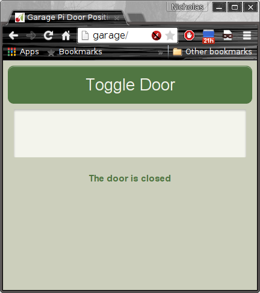

# garage-rpy
A Garage Door Home Automation Controller using a Rasberry Pi with functionality exposed via a webpage or a raw socket. Put your garage door online! 

#Huh?  What?  How?  Why? 
Why not??!!!??!   I dont want to spend $400 on some mostly pathetic garage door opener when what I really need is a 
whole new door besides the fact the new openers come with all sorts of vendor lock in (and shoveling your data online).
I also just wanted to be able to open the garage on my way in from commuting home. It may seem quite ugly and simple,
but more KISS would make the world a bit easier to navigate.

#Schematic
This is essentially just a solid state relay connected in parallel with the standard open/close buttons and a 10-turn pot
to detects where the door is physically located.  I used a zero-crossing 2-amp (WAY overkill) solid state relay and some
unknown 10-turn pot I found on amazon.  Sorry for the utter lack of theory - feel free to contact me if you want some more info.


Schematic is saved in a format QElectroTech can open.

#Physical Installation

I have a few tools and tend to overbuild thing, but I am sure there are easier ways to attach this.  Just be sure you install the
pot/potentiometer in such a way that it can freely move across the entire cycle of the door opening and closing and do not create 
mechanical strains tha will eventually destroy stuff.  I counted that my tensioner rod only rotated ~6 times, so I bought a 10-turn
pot and slapped it in.  Your milage may vary.  The A2D frontend is generic enough that if you do something else it wont matter if
you can provide a decent enough tranfer function in your ini file.

My hacked install of the pot into a 1980s era garage door tensioner rod.



#Software Installation
This is all written in python with a smathering of CSS/JS/HTML.

##Required Libaries

* [RPi.GPIO](https://pypi.python.org/pypi/RPi.GPIO)
* [spidev](https://pypi.python.org/pypi/spidev/2.0)
* [cherrypy](http://www.cherrypy.org)

##Init file
There is a sample debian compatable RC file that can be copied to /etc/init.d, altered, and added to the boot sequence via something like below.

```sh
	cp init/garage-rpy /etc/init.d/
	vim /etc/init.d/garage-rpy #edit some defaults
	update-rc.d garage-rpy defaults
```

#Configuration File Definitions
If you want a full example, you should probably look at [sample_config.ini](sample_config.ini) for a more details.
[This](config.ini) is the configuration I have been using.


# CherryPy Interface
There is a simple AJAX enabled web interface that is bundled to make it easier to deploy.  This can be started by running 

```sh 
	sudo python cherrypy-garagepy.py
```

or by following the instructions given above to install the INIT file.

##Normative Web Interface

Screenshots of the web interface




## CLI Apps

In the [scripts](scripts) folder, there are a couple scripts that may be handy to CLI gurus. Provided scripts are combination of curl and [jq](http://stedolan.github.io/jq/).

- door-pos.sh - Displays a string that show where the door is and if it is open or not.
- open-door.sh - Opens / closes door

http://stedolan.github.io/jq/

# Socket Server Interface (Obsolete)

Start the server with a valid configuration file as described above

```sh

	python socket-garagepy.py  ../scripts/config.ini

```

In this example, ``` tcp_port = 5000 ```.  You can use *netcat* / *nc* / *ncat* to interact with it such as below:


```sh

	nickp@lappy /home/nickp % ncat raspi 5000

	help

	Available commands:
	help              Show this message
	config            dump the ini configuration 
	count <channel>   Retrieves the raw count values of a2d <channel>
	value <channel>   Retrieves the converted value of the a2d <channel>
	v     <channel>   Retrieves the converted value of the a2d <channel> with units
	pulsegpio         Pulse gpio pin as set in the configuration
	quit|exit         Close the socket connection

	Additionally, if valid JSON document is passed, with the 
	key of "channels" defined to be an array of channels to 
	query such as:
	  
	  {
	    "channels": [0, 3, 4]
	  }

	A JSON document similar to below will be returned:
	  {
	    "counts": [514, 1024, 152], 
	    "values": [2.43, 4690, 25],
	    "units": ['V', 'mV', 'C']
	  }

	Where the indexes of the array are mapped to channel 
	#0, 3, and 4 respectively. It is also possible to set
	the "pulsegpio" via a "pulsegpio": 1 directive, or
	you can sever the socket connection after via setting a 
	"quit" or "exit" section.  Their values are ignored.

	EG:

	{"channels": [0], "pulsegpio": 1, "exit": 0} 

	would:

	- Return something like: {"counts": [514], "values": [2.5], "units": ['V'], "pulsed": 1}
	- Pulse the GPIO as per the config, and
	- Close the socket.

	count 0
	2110
	>v 0
	51.54 % 
	>value 0
	51.5869140625
	>{"channels": [0, 1], "quit": 1}
	{"units": ["%", "C"], "counts": [2111, 41], "values": [51.5380859375, 34.15474457157549]}


	Ncat: Broken pipe.

```

You can also do one-liners like this to feed directly to ncat to get values, just make sure you escape the shell items properly with *echo*.

```sh

	nickp@lappy /home/nickp %  echo {\"channels\": \[0\], \"quit\": 1 \} | ncat raspi 5000
	{"units": ["%"], "counts": [2111], "values": [51.5380859375]}
	nickp@lappy /home/nickp %

```
